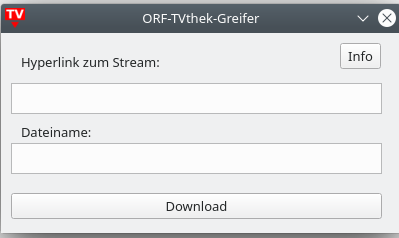
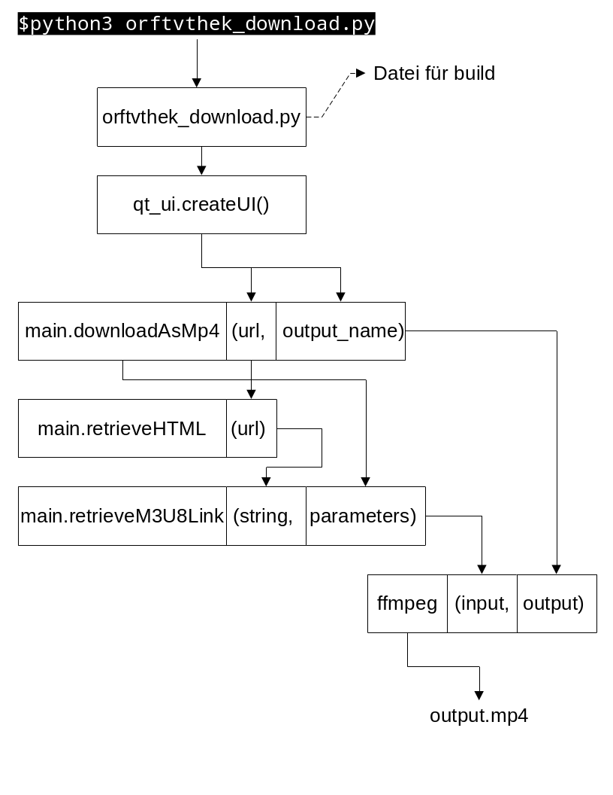

# orftvthek_download
Ein Werkzeug um Videos aus der ORFTvthek herunterzuladen
## Anwendung
Mit diesem Programm kann man Inhalte der ORFTVthek mit einer benutzfreundlichen Oberfläche einfach herunterladen.

Hierfür muss man lediglich die Internetaddresse des gewünschten Inhaltes in der oberen Programmzeile eingeben und dann dazu unten den gewünschten Dateinamen eingeben.
Wenn man dies getan hat, kann man auf "Download" klicken und das Video wird heruntergeladen.
## Funktionsweise
### Struktur
Im folgenden wird die Strukturiereung des Codes illustriert.

### Die Suche nach dem M3U8-Hyperlink
Die Funktion getM3U8Link dient dazu, aus einem gegebenen HTML-String den Link der M3U8 Datei für den gewünschten Stream zu finden.

Hierbei ist es nicht so einfach aus der ORFTvThek diesen Link herauszufinden. Bei händischer Unterscuhung kommt man darauf dass dieser sich in einem JSON-Container befindet, der sich unter:

```
  <main class="main">
    ...
    <div class="mod_player html5">
      ...
      <div class="player_viewport ">
        ...
        <div class="jsb_ jsb_VideoPlaylist">
          <div class=" " data-jsb="{..}">
```
(Stand 15.05.2024) 

Im JSON-Container ``data-jsb`` befindet sich der M3U8 Link. Hierfür kann man den ganzen String innerhalb des Containers zu einem Python-Dictionary umwandeln und dann mittels entsprechender Indizierung den gewünschten Link erhalten.

<mark>Dabei ist es wichtig anzumerken, dass die ORFTVthek sich in Zukunft ändern kann, was bedeuten würde, dass der M3U8-Link nicht mehr an derselben Stelle zu finden ist.</mark>
Hierfür müsste man dann in der Funktion ``getM3U8Link(string, parameters)`` gegebenenfalls die parameter entsprechend ändern, oder im schlimmsten Fall auch das Verzeichnis des JSON-Containers, indem sich der Link versteckt. Hierfür ist es zu empfehlen, den Quellcode eines Streams in der TVThek mit den Browser-Entwicklertools zu untersuchen um den Link händisch auffinddig zu machen. Anhand dessen kann man dann ``getM3U8Link(string, parameters)`` auf den neusten Stand anpassen.

